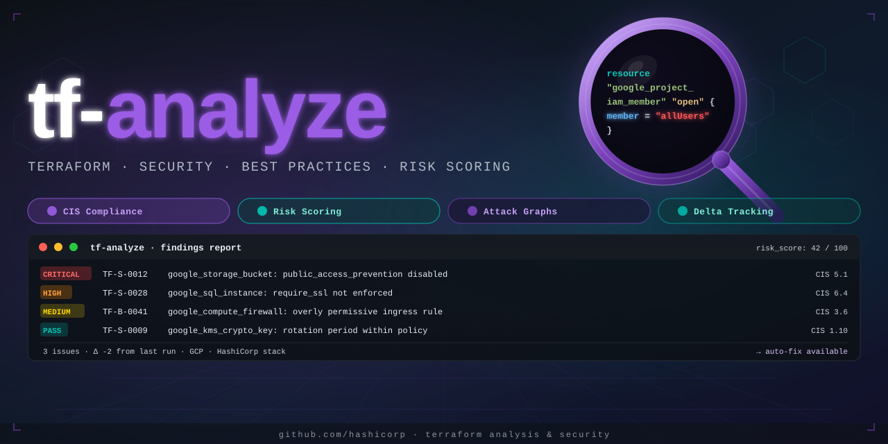
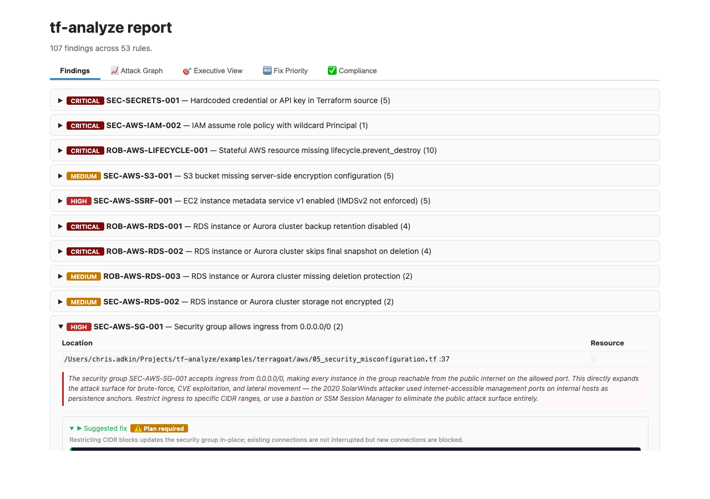
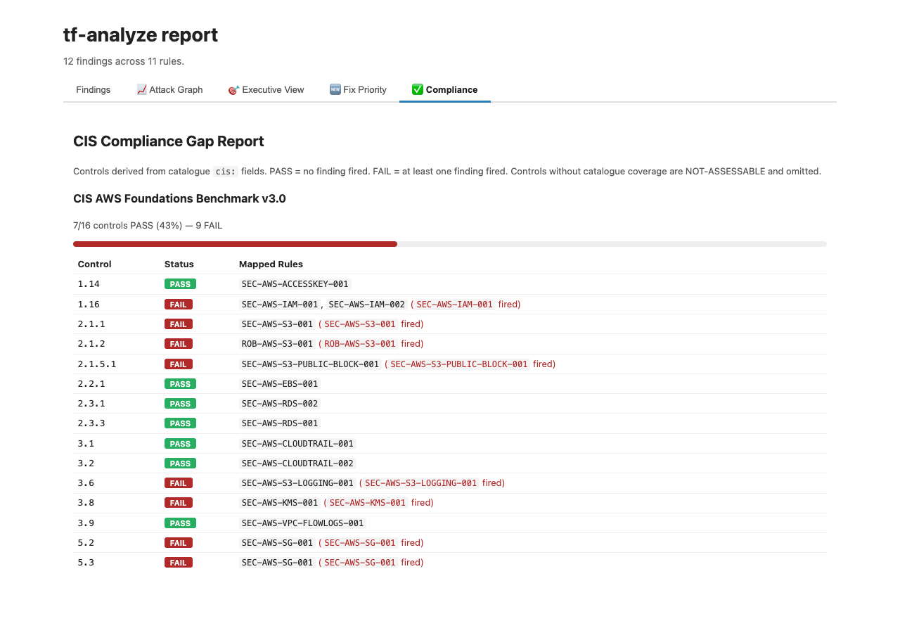

# tf-analyze



A Claude Code skill for auditing Terraform code. Static + plan-time detection, catalogue-anchored findings, delta tracking, SARIF/HTML/JSON outputs, optional `python-hcl2` heredoc-aware parser. GCP-first; AWS and Azure secondary.

The skill is invoked from Claude Code as `/tf-analyze`. The detection engine (`scripts/detect.py`) is also runnable standalone for CI gating, listing rules, scaffolding new ones, etc. — see [`docs/cli.md`](docs/cli.md).

---

## Capabilities

This is the upfront list — what the skill detects, what outputs it produces, and what it does that the OSS-tool field generally doesn't. If a capability isn't here, it isn't there.

### Detection (catalogue-anchored, 154 rules)

| Domain | Coverage |
|---|---|
| **Security (`SEC-*`)** | Overly broad IAM (project-level admin roles), public IAM (`allUsers`/`allAuthenticatedUsers`), member-at-both-scopes, sensitive outputs/variable leaks, `data.external` injection risks, hardcoded secrets/API keys/passwords in `.tf`, `.tfvars`, `.auto.tfvars`, and `.tfvars.json`, Azure subscription-scope role assignments, orphan UAMIs, Key Vault without network ACL deny + key rotation policy, App Service HTTPS-only, AKS network policy, GCS public_access_prevention/UBLA, GCE default-SA + public-IP + missing Shielded VM config, Cloud SQL public IPv4, GKE network policy, VPC subnet flow logs (GCP + AWS), CloudTrail multi-region + log validation, RDS/Aurora + EBS encryption, KMS rotation, Vault `data` source on TF 1.10+, `.tfstate` in repo, world-open SSH (tcp:22) and RDP (tcp:3389), GCP firewall exposing database/cache ports (MySQL/PostgreSQL/MSSQL/Redis/MongoDB/Elasticsearch/Memcached) to 0.0.0.0/0, ECR scan-on-push + lifecycle policy, S3 missing public access block, S3 bucket missing server access logging, Cloud Run public ingress, SQS/SNS/ElastiCache missing encryption, Azure SQL world-open firewall rule, ACR admin account enabled, AWS GuardDuty not enabled, Azure subscription activity log not forwarded, EC2/EKS launch template IMDSv2 not enforced, GCP service account key created in Terraform, CloudFront distribution with allow-all HTTP policy or missing access logging, Cognito user pool MFA disabled, Secrets Manager secret missing rotation, API Gateway stage missing access log settings, Cloud Memorystore Redis missing auth or TLS, Azure Linux VM allows SSH password authentication. |
| **Robustness (`ROB-*`)** | Missing `lifecycle.prevent_destroy` on stateful GCP, AWS, and Azure resources, S3 bucket `force_destroy = true`, S3 backend without DynamoDB state locking, `required_providers` entry missing `version` constraint, `count = X ? 1 : 0` boolean-count pattern, `count`/`for_each` mix, unguarded `[count.index]` references, `for_each` over a `tolist`, unused variables/outputs, deprecated `template_file`, stale `moved` (TF 1.5) and `removed` (TF 1.7) blocks, missing variable validation, `ignore_changes = all`, provider alias mismatches, inconsistent backends, stale remote state, `check` block missing `assert` (TF 1.5+), `precondition` missing `error_message`, RDS/Aurora missing deletion protection, backup retention, and skip-final-snapshot. |
| **Stack (`STK-*`)** | GKE: missing Workload Identity, private nodes, secrets encryption, master authorized networks, node-pool secure-boot/integrity-monitoring. EKS: private endpoint, control plane logging, secrets encryption, OIDC/IRSA, partial log-type detection (missing `audit`/`authenticator` when other types are enabled). AKS: Workload Identity, private cluster, authorized IP ranges. EC2/EKS launch template IMDSv2. GCS: missing versioning, logging-target leak. KMS: missing rotation period, key/keyring location parity. CloudSQL/RDS/Aurora/MySQL/PostgreSQL: deprecated attributes, missing backups, missing deletion protection, no SSL enforcement, EOL engine version. Route53 DNSSEC. BigQuery: missing CMEK. Pub/Sub: missing CMEK. Azure: NSG missing flow log resource, SQL DB missing TDE resource, deprecated single-server MySQL/PostgreSQL, storage blob versioning, Key Vault key rotation. Lambda: missing dead-letter queue and missing X-Ray tracing config. ECS: container insights disabled. Artifact Registry: missing CMEK (kms_key_name). |
| **Operational (`OPS-*`, `STYLE-*`, `MOD-*`, `COST-*`, `CI-TEST-*`)** | Missing labels/tags on GCP, AWS, and Azure resources, prod-scoped deletion protection, missing variable descriptions, unpinned modules, expensive resources without cost controls (GCP + AWS via `COST-AWS-RISK-001`: CloudWatch log groups without retention, ASGs without max_size), modules without `*.tftest.hcl`. |
| **Cross-resource (`graph_check`)** | Cluster→all-node-pools assertions, KMS key-ring↔consumer location parity, IAM project+resource breadth, GCS logging-target hardening. New graph functions register in `_GRAPH_CHECKS` in `detect.py`. |
| **CIS mapping** | 69 rules carry CIS control mappings across CIS GCP Foundations Benchmark v4.0, CIS AWS Foundations Benchmark v3.0, and CIS Azure Foundations Benchmark v2.0 (e.g., GCP 1.6, 5.1, 6.6.7, 8.5.2; AWS 2.1.1, 2.3.1, 3.1, 3.9; Azure 1.21, 4.1.2, 6.5). |

`python3 scripts/detect.py --list-rules` enumerates everything; `--explain RULE-ID` prints the full entry for one.

### Execution modes

| Mode | Cost | What it does |
|---|---|---|
| `static` (default) | ~5 min | Full report against the source HCL — no credentials needed. |
| `diff` | ~1 min | Per-file scan restricted to `.tf` files changed since `<diff-base>` (auto-detected `main`/`master`). Right for PR CI. |
| `plan` | ~15 min | Static + plan-time re-evaluation of `resource_arg`/`resource_missing_arg`/`resource_present`/`hcl_attr`/`data_source_present` rules against `terraform show -json` resolved values. Catches violations that only appear after variable resolution. |
| `verify-fixed` | ~1 min | Reads a prior report and re-probes each finding's location — `FIXED` / `STILL PRESENT` / `MOVED`. Useful for asserting a fix landed before closing the ticket. |
| `self-test` | ~2 min | Walks `fixtures/` against the catalogue. Run before committing skill changes. |

### Output formats

- `markdown` (default) — full report with executive summary, finding density by file, action plan, suppressed findings section.
- `json` — machine-readable findings list. Used by `--compare` and CI integrations.
- `sarif` — SARIF v2.1.0 with `helpUri`, `partialFingerprints`, `security-severity` (9.5/7.5/5.0/3.0/1.0), CIS tags. GitHub Code Scanning renders these as line-level annotations on the PR diff. Schema documented in `SKILL.md`.
- `html` — self-contained report with inline CSS, urgency-coloured badges, collapsible per-rule details. Right for sharing with non-CLI reviewers.
- `--attack-graph` — (flag, works with any format) builds a directed attack-path graph from internet-reachable resources to crown jewels. HTML output adds interactive Attack Graph, Executive View, and Fix Priority tabs; text/Markdown output appends a Mermaid flowchart block. HIGH/CRITICAL findings gain adversarial narrative paragraphs referencing real-world breaches. Findings on critical-path resources are promoted one urgency tier.
- `--show-fixes` — renders catalogue `fix_hcl` snippets alongside each finding with a coloured **Fix Disruption** badge (`Non-disruptive` / `Plan required` / `Forces replacement`). HTML: dark-themed `<pre>` inside the finding detail. Text: disruption note + indented HCL below the finding line.
- `--gen-tests OUTDIR` — generates native `terraform test` (`.tftest.hcl`) assertion files for each finding whose catalogue entry defines a `test_template`. Converts static findings into permanent regression guards.
- `--compliance` / `--format compliance` — maps findings against CIS AWS v3.0, GCP v4.0, and Azure v2.0 benchmark controls declared in catalogue `cis:` fields. HTML (`--compliance`): adds a Compliance tab with per-framework progress bars + PASS/FAIL tables. Text (`--format compliance`): outputs a plain grouped table. `--oscal PATH` writes an OSCAL Assessment Results JSON alongside any format (FedRAMP-compatible).
- `--mode fleet` — scans multiple repos (`--target` repeated or `--targets-file`), cross-correlates findings that appear in more than one repository, and outputs a fleet summary table.
- `--mode trend --lookback N` — walks N days of git history (default 30), reconstructs `.tf` content at each commit via `git show`, re-runs the pattern engine, and outputs a date-by-date new/resolved/net/total table.
- `--mode pr-review` — posts findings as inline GitHub PR review comments via the REST API. Findings with `fix_hcl` appear as `` ```suggestion ``` `` blocks (one-click apply). Requires `GITHUB_TOKEN` env var, `--repo OWNER/REPO`, and `--pr-number N`.

### Screenshots

**Findings tab** — urgency-badged collapsible rules; HIGH/CRITICAL findings show adversarial narrative and a "Suggested fix" HCL block (`--show-fixes`):


**Attack Graph tab** — interactive force-directed SVG (46-node AWS corpus). Pills are colour-coded by resource category; the critical path is highlighted in red; crown jewels have a gold border.


**Executive View tab** — findings reorganised into Entry Points / Lateral Movement / Crown Jewels at Risk / Blind Spots attack stages, with a critical-path narrative banner:


**Fix Priority tab** — findings ranked by attack-path centrality. Crown jewels blocked, score, and CRITICAL-PATH / INET-REACHABLE badges (`--attack-graph`):


**Fix Disruption badge** — coloured disruption classification inline with the suggested fix (`--show-fixes`):



**Compliance tab** — CIS benchmark PASS/FAIL per control with progress bars across AWS, GCP, and Azure (`--compliance`):



### Differentiators (vs tfsec / Checkov / KICS / tflint)

1. **Recommendation verification.** Every recommendation can be validated by writing the proposed HCL into a sentinel `terraform init`-ed tempdir and running `terraform validate`. No other scanner self-checks its own fix suggestions.
2. **Delta tracking.** Each finding has a stable `(catalogue_id, file, resource)` join key. Reports compare against the previous run and surface `Resolved` / `New` / `Unchanged`. tfsec/Checkov re-emit the full set every run with no longitudinal memory.
3. **Suppression with expiry.** `.tf-analyze-ignore.yaml` entries take an `expires:` field. Expired suppressions don't silently re-surface as "new" findings — they're tagged `was_suppressed_until: <date>` so the report explicitly shows them.
4. **CLAUDE.md convention verification.** Step 11 of the LLM-judgement pass reads project-local docs and verifies code matches stated rules ("PKI TTLs: leaf 72h", "no default credentials"). No OSS scanner reads project docs.
5. **Provider/Terraform version dispatch.** Catalogue entries can declare `applies_when: { min_terraform: "1.10" }` or `min_provider: { google: "5.0" }`. Rules silently skip when the target's `required_version` / `required_providers` constraint can't reach the minimum.
6. **Cross-resource (graph) detector kind.** `pattern_kind: graph_check` invokes a registered Python function with a resource index — used for "all node pools must X", logging-target hardening, IAM breadth, KMS location parity. The scaffolding generalises; new graph rules are ~30 LoC each.
7. **`scripts/detect.py --new-rule RULE-ID`** scaffolds catalogue YAML + fixture skeleton + self-test stub. Authoring a new rule is `--new-rule SEC-FOO-007` then editing the TODOs.
8. **Optional `python-hcl2` fast-path** for heredoc-aware attribute extraction. Default install is stdlib-only; `--use-hcl2` (or `TF_ANALYZE_USE_HCL2=1`) opts in when `python-hcl2` is installed. Off by default to keep the install zero-pip-deps.
9. **Attack-path graph.** `--attack-graph` infers directed edges from HCL references (IAM profiles → roles → policies, KMS key IDs, SG membership, GCP service account bindings) and runs BFS from internet-reachable resources to crown jewels. The critical path is highlighted; findings on path nodes are promoted one urgency tier. HTML output is a force-directed interactive SVG; text output is Mermaid.
10. **Adversarial scenario narratives.** HIGH and CRITICAL findings in HTML reports include a pre-written 2-3 sentence attack scenario referencing a confirmed public breach (Capital One 2019, SolarWinds 2020, Tesla 2020 Kubernetes, Samsung 2022, Twitch 2021).
11. **Attacker's Eye View.** `--attack-graph --format html` adds an "Executive View" tab that reorganises findings into 4 attack stages (Entry Points, Lateral Movement, Crown Jewels at Risk, Blind Spots) with a critical-path narrative banner. Makes risk comprehensible to non-technical stakeholders.
12. **Intent-implementation gap detection (INT-*).** New rule family that flags when Terraform code contradicts its own stated intent — variable names/descriptions signalling security requirements that default to false, prod-tagged resources with `deletion_protection=false` or `force_destroy=true`. Only possible with semantic name analysis; no grep-based scanner does this.
13. **Module supply-chain analysis (MOD-SUPPLY-*).** Flags modules pinned to mutable git refs (`?ref=main`), raw git sources that bypass registry integrity hashing, and registry modules missing `version` constraints. Guards against dependency confusion and supply-chain injection.
14. **Reachability-aware urgency.** When `--attack-graph` is active, findings on critical-path resources are promoted one urgency tier and get a `CRITICAL-PATH` badge in HTML. Findings on resources with no internet-reachable path are demoted one tier. Urgency reflects topology, not just rule severity.
15. **Generated `terraform test` files (`--gen-tests`).** Converts findings into native Terraform test assertions (`.tftest.hcl`). Running `terraform test` in CI then permanently guards against the same misconfiguration being re-introduced. No other scanner produces native test artefacts.
16. **Fleet mode (`--mode fleet`).** Scans multiple repos in one invocation and cross-correlates findings — the same misconfiguration in multiple repos is flagged `FLEET-WIDE` so you can fix it organisation-wide at once.
17. **Risk trend (`--mode trend`).** Walks git history and outputs a per-commit new/resolved/net/total findings table. Shows whether your security posture is improving or degrading over time — CISO-grade longitudinal visibility.
18. **Fix centrality scoring.** `--attack-graph` now also ranks findings by attack-path impact: BFS simulation removes each finding's resource from the graph and counts how many crown-jewel resources become unreachable. HTML adds a **Fix Priority** tab with ranked table — "fix this first" for time-constrained engineers. No other scanner does attack-graph-aware remediation prioritisation.
19. **Safe-to-fix disruption classification.** Every catalogue `fix_hcl` snippet now carries a `fix_disruption` tag (`none` / `plan_required` / `forces_replacement`). `--show-fixes` displays a coloured badge and optional note so engineers know whether applying the fix requires a maintenance window before they act.
20. **CIS compliance gap report.** `--compliance` / `--format compliance` maps all 70 CIS-mapped catalogue rules against benchmark controls and reports PASS/FAIL per control, grouped by framework. `--oscal PATH` outputs OSCAL Assessment Results JSON (v1.1.2) for FedRAMP and GRC tool ingestion. The only OSS Terraform scanner with native OSCAL output.
21. **GitHub PR Suggestions (`--mode pr-review`).** Posts findings as inline GitHub PR review comments with one-click `` ```suggestion ``` `` fix blocks. Engineers can accept a `metadata_options` IMDSv2 fix, a security group restriction, or a KMS rotation flag directly from the PR review UI, without opening a separate ticket.

---

## Quickstart

```sh
# Install (symlinks the repo into ~/.claude/skills/tf-analyze)
git clone <this-repo> ~/Projects/tf-analyze
cd ~/Projects/tf-analyze
./install.sh

# In Claude Code:
/tf-analyze                                    # full audit, all areas
/tf-analyze focus:security mode:diff           # PR review
/tf-analyze mode:verify-fixed                  # confirm prior fixes

# Standalone (no Claude Code):
python3 scripts/detect.py --target /path/to/tf
python3 scripts/detect.py --target . --mode diff --fail-on HIGH --format sarif > out.sarif
python3 scripts/detect.py --list-rules
python3 scripts/detect.py --explain SEC-GCP-IAM-001
python3 scripts/detect.py --new-rule SEC-FOO-007

# Try the demo corpus:
python3 scripts/detect.py --target examples/terragoat
```

---

## Repository layout

```
.
├── SKILL.md                # Skill prose — invoked by Claude Code as /tf-analyze
├── README.md               # This file
├── install.sh              # Wires the repo into ~/.claude/skills/tf-analyze
├── catalog/                # ~124 rule definitions (one YAML per rule)
│   └── README.md           # Schema reference
├── fixtures/               # Single-rule isolation tests, used by self_test
├── examples/
│   └── terragoat/          # Multi-file deliberately-vulnerable demo corpus
├── scripts/
│   ├── detect.py           # Detection engine (~2400 LoC, stdlib only)
│   ├── self_test.py        # Walks fixtures/ vs catalog/, asserts expected IDs
│   ├── test_schema.py      # Catalogue schema validator regression test
│   ├── stub-status.py      # Reports stale `status: stub` entries by age
│   └── gen-cli-docs.py     # Regenerates docs/cli.md from argparse
├── docs/
│   └── cli.md              # Auto-generated CLI reference for detect.py
├── integrations/           # Pre-commit + GitHub Actions configs
└── reports/                # Example report outputs (delta-tracking demos)
```

The skill files (`SKILL.md`, `catalog/`, `scripts/`, `fixtures/`, `integrations/`) are at the repo root so `./install.sh` can `ln -s` the whole directory into `~/.claude/skills/tf-analyze` — no nested `skill/` subdir.

---

## Demo corpus — `examples/terragoat/`

A three-cloud intentionally-vulnerable Terraform corpus (GCP, AWS, Azure) organised by OWASP Top 10, modelled on Bridgecrew's [`terragoat`](https://github.com/bridgecrewio/terragoat). 30 files across the three clouds trigger 260 findings against the current rule set, covering SEC, ROB, STK, OPS, and COST rules for all three providers.

It serves three jobs:

1. **Smoke test for the engine.** `python3 scripts/detect.py --target examples/terragoat --format json | python3 -c "import json,sys; d=json.load(sys.stdin); print(len(d['findings']))"` should equal **260**. Drift in this number is a regression signal.
2. **Calibration target for new rules.** When you write a new detector, add a triggering snippet to the relevant `examples/terragoat/*.tf` file and re-run — your new ID should appear alongside the existing ones with no spurious cross-talk.
3. **Live demo for first-time users.** Reports against this corpus are realistic-shaped (multi-file, GCP+Azure+Vault, real cross-resource interactions) rather than the isolated single-rule fixtures under `fixtures/`.

See [`examples/terragoat/README.md`](examples/terragoat/README.md) for the rule-by-rule breakdown.

### Why both `fixtures/` and `examples/terragoat/`?

- **`fixtures/`** are minimal, one-rule-per-directory inputs used by `self_test.py`. A failing self-test points at exactly which rule broke.
- **`examples/terragoat/`** is a representative *project* exercising rules in combination — including `graph_check` rules that need ≥2 resources to fire and corpus-level rules (`CI-TEST-001`) that need a directory not a file.

Isolated fixtures alone miss interaction bugs; a project-shaped corpus alone loses diagnostic precision. Both serve.

---

## Adding a rule

```sh
python3 scripts/detect.py --new-rule SEC-MYDOMAIN-001
# wrote catalog/SEC-MYDOMAIN-001.yaml
# wrote fixtures/sec_mydomain_001/main.tf
```

Edit the two scaffolded files (TODOs marked clearly), then:

```sh
python3 scripts/self_test.py             # regression test
python3 scripts/detect.py --explain SEC-MYDOMAIN-001
python3 scripts/detect.py --strict-catalog --target /tmp # validates schema
```

Schema reference at [`catalog/README.md`](catalog/README.md). Pattern kinds: `grep`, `resource_arg`, `resource_missing_arg`, `resource_present`, `hcl_attr`, `data_source_present`, `resource_body_contains`, `firewall_open_port`, `moved_block_present`, `removed_block_present`, `check_block_missing_assert`, `precondition_missing_error_message`, `graph_check`, plus the corpus-level kinds (`cross_module`, `output_sensitive_leak`, `templatefile_sensitive_leak`, etc.). For cross-resource rules, register a Python function in `_GRAPH_CHECKS` and reference it from the catalogue YAML via `kind: graph_check, function: <name>`.

---

## CI integration

The skill ships with two ready-to-use configs under `integrations/`:

- **`integrations/pre-commit-hook.yaml`** — diff-mode hook (~<2s on a 5k-file repo). Resolves the skill via `$TF_ANALYZE_SKILL_ROOT` with a fallback to the install path, so non-standard install locations work.
- **`integrations/github-action.yml`** — full Actions workflow with SARIF upload to Code Scanning + HTML artefact. PR runs are diff-mode + fail-on-HIGH; pushes to main are full static scans.

The repo's own CI (`.github/workflows/ci.yml`) gates the skill itself: `self_test.py`, `test_schema.py`, `gen-cli-docs.py --check`, `stub-status.py --age 180d`. See `integrations/README.md` for adapting to GitLab / CircleCI / Buildkite (single-line `python3` invocation works anywhere).

---

## Maintenance

- `python3 scripts/stub-status.py --age 90d` — find stubs older than 90 days. Stubs are catalogue entries with `status: stub`; they're excluded from scans by default and indicate a half-finished rule. The CI gate runs at `--age 180d` (warns earlier than half a year is over-zealous).
- `python3 scripts/gen-cli-docs.py` — regenerate `docs/cli.md` after any argparse change. CI runs `--check` and fails if the docs are stale.
- `python3 scripts/test_schema.py` — synthetic broken-YAML regression test for the catalogue validator. Add a new case here when extending the schema.

---

## Provenance

This skill was built and refined inside the [`consul-mcp-agents`](https://github.com/example/consul-mcp-agents) project — an HCP Vault + Consul + GKE stack. Many catalogue rules trace to incidents and audit findings on that infra. The skill is provider-agnostic in design and exercised against the GCP + HashiCorp + Azure providers; AWS coverage is intentionally lighter (3 SEC rules) as a reflection of the original use case.
