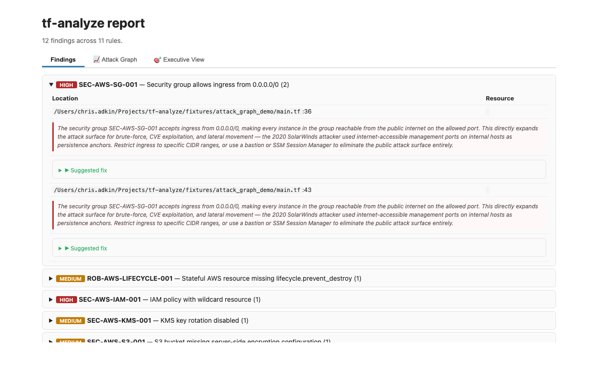
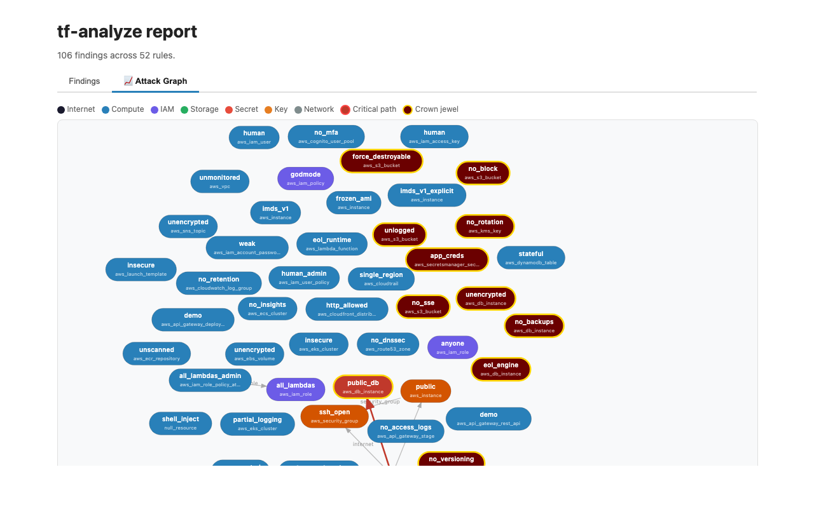
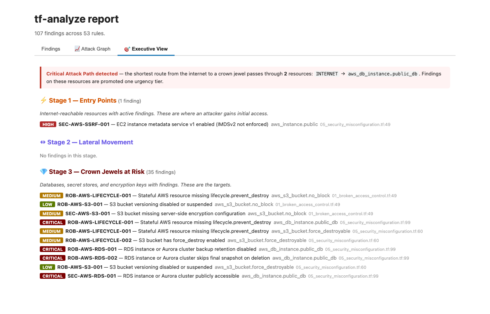
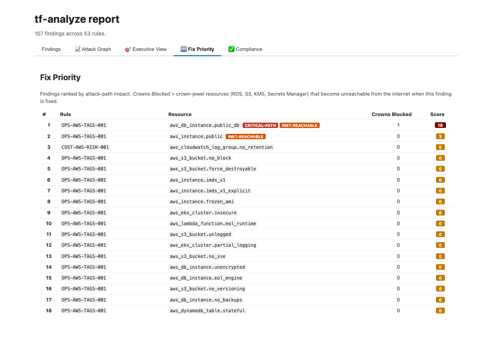

<p align="center">
  
</p>

# tf-analyze

> Static + plan-time Terraform analysis with attack-graph prioritisation, MITRE ATT&CK mapping, and one-click PR fix suggestions. **Drop into CI in under 5 minutes.**

<!-- Status row — is this project alive? -->
[](https://github.com/ChrisAdkin8/tf-analyze/actions/workflows/ci.yml)
[](https://github.com/ChrisAdkin8/tf-analyze/releases)
[](https://github.com/marketplace/actions/tf-analyze)
[](https://marketplace.visualstudio.com/items?itemName=tfanalyze.tf-analyze)
[](https://github.com/ChrisAdkin8/tf-analyze/pkgs/container/tf-analyze)
[](https://tfanalyze.com/scan/ChrisAdkin8/tf-analyze)


<!-- Content row — what does it cover? -->


[](https://chrisadkin8.github.io/tf-analyze/rules/)

**[Quickstart](#quickstart) · [Why tf-analyze?](#why-tf-analyze) · [Features](#features) · [Integrations](#integrations) · [Screenshots](#screenshots) · [Documentation](#documentation) · [Adding a rule](#adding-a-rule) · [Demo corpora](#demo-corpora--examples) · [Repo layout](#repository-layout) · [Contributing](#contributing--maintenance) · [Provenance](#provenance) · [License](#license)**

Same engine, ten surfaces — Claude Code skill, Python CLI, GitHub Action, Docker, pre-commit hook, LSP server, VS Code extension, HCP Run Task, [MCP server](integrations/mcp-server/) for AI agents, [native Terraform provider](terraform-provider/). Pick the one that fits your workflow; the rule catalogue, score, and `fix_hcl` are identical across all of them.

### Rules at a glance

| Cloud | Security | Hardening | Ops & Reuse | **Total** |
|---|---:|---:|---:|---:|
| AWS | 62 | 25 | 4 | **91** |
| GCP | 41 | 47 | 3 | **91** |
| Azure | 56 | 32 | 3 | **91** |
| K8s / Helm | 12 | 6 | 0 | **18** |
| Cross-cloud / engine | 21 | 27 | 14 | **62** |
| **Total** | **192** | **137** | **24** | **353** |

Hardening = `ROB-*` + `STK-*`; Ops & Reuse = `OPS-*` + `COST-*` + `MOD-*` + `MOD-REUSE-*` + `INT-*` + `CI-*` + `STYLE-*`. Full per-family breakdown and shape-by-cloud commentary in [Detection ↓](#detection).

---

## Quickstart

### 1. Docker — no Python install required

```sh
docker run --rm -v "$(pwd):/workspace" \
  ghcr.io/chrisadkin8/tf-analyze \
  --target /workspace --format html > report.html
open report.html
```

### 2. From source (Python ≥ 3.10)

```sh
git clone https://github.com/ChrisAdkin8/tf-analyze.git
cd tf-analyze
./install.sh                                          # installs as a Claude Code skill
pip install python-hcl2                               # optional fast-path (default-on if present)

python3 scripts/detect.py --target /path/to/terraform
python3 scripts/detect.py --target . --mode diff --fail-on HIGH --format sarif > out.sarif
python3 scripts/detect.py --list-rules
python3 scripts/detect.py --explain SEC-AWS-IAM-POLICY-005
```

### 3. Inside Claude Code

```text
/tf-analyze                                # full audit, all areas
/tf-analyze focus:security mode:diff       # PR review
/tf-analyze mode:verify-fixed              # confirm prior fixes
```

### 4. VS Code extension

Live diagnostics, Quick Fix, attack graph, Module Reuse Advisor, and a `vscode://` URI handler — all from a self-contained `.vsix` (the engine and rule catalogue are bundled; no companion repo to clone).

```sh
# Marketplace (preferred, once the listing is live)
code --install-extension tfanalyze.tf-analyze

# Or from a downloaded .vsix (current path until the Marketplace listing publishes)
code --install-extension tf-analyze-0.1.58.vsix
```

Open any Terraform workspace and the six status-bar shortcuts appear bottom-left:

```
🛡 tf-analyze: 82 (B) · 7 findings   🛤 Attack Graph   🔀 Delta   ✅ Compliance   🪄 Remediate   📦 Module Reuse
```

To see the deeper panels render against rich input, open one of the showcase corpora in [`examples/`](examples/) — `examples/module-reuse-demo/` (📦) or `examples/attack-graph-demo/` (🛤). Full reference: [`docs/vscode-extension.md`](docs/vscode-extension.md).

### 5. GitHub Action

```yaml
- uses: ChrisAdkin8/tf-analyze@v1
  with:
    fail-on: HIGH
    post-pr-comment: true                # inline `suggestion` blocks on every PR
    compliance-framework: owasp_iac      # optional — adds a collapsible compliance gap report
    attack-graph: true                   # optional — embeds Mermaid attack graph in PR summary
    ref: v0.2.6                          # optional — shorthand for image tag (default: :latest)
```

`ref:` is a convenience alias — `ref: v0.2.6` is equivalent to `image: ghcr.io/chrisadkin8/tf-analyze:0.2.6` (the leading `v` is stripped before building the docker tag, since `docker/metadata-action` publishes semver tags without it). Both `v0.2.6` and `0.2.6` work; non-semver values like `main` or `latest` pass through untouched. Set `ref:` or `image:`, not both. See [`action.yml`](action.yml) for the full input reference, and [`integrations/github-action.yml`](integrations/github-action.yml) for an alternative install-from-source workflow that adds SARIF upload + HTML artefact.

---

## Why tf-analyze?

A scanner is only as good as the actions it provokes. Where comparable tools stop at "here is a finding", `tf-analyze` ranks findings by attack-path centrality, ships an HCL fix, and surfaces the adversarial scenario on hover.

### The six things only tf-analyze ships

| | tf-analyze | tfsec | checkov | Prowler |
|---|---|---|---|---|
| Attack-path graph promoting findings on the critical path | ✅ | ❌ | ❌ | ❌ |
| Blast-radius analysis (`--blast-radius`; per-finding + top-N) | ✅ | ❌ | ❌ | ❌ |
| CISA KEV + FIRST.org EPSS exploitability ranking (`--rank-by`) | ✅ | ❌ | ❌ | ❌ |
| Drift mode against `terraform show -json state.tfstate` | ✅ | ❌ | ❌ | ⚠️ live API only |
| Public web scanner — paste a GitHub URL, get a permalink | ✅ [tfanalyze.com](https://tfanalyze.com) | ❌ | ❌ | ❌ |
| Module Reuse Advisor with lines-saved ROI | ✅ | ❌ | ❌ | ❌ |

<details>
<summary><b>Full feature matrix (26 rows) — click to expand</b></summary>

| | tf-analyze | tfsec | checkov | Prowler |
|---|---|---|---|---|
| Static HCL analysis | ✅ | ✅ | ✅ | ❌ (live) |
| Plan-time (`terraform show -json`) analysis | ✅ | ⚠️ partial | ✅ | ❌ |
| Built-in attack-path graph | ✅ | ❌ | ❌ | ❌ |
| Module Reuse Advisor with lines-saved ROI | ✅ | ❌ | ❌ | ❌ |
| Aggregate risk score + letter grade (A–F) | ✅ | ❌ | ❌ | ❌ |
| `fix_hcl` snippet on every fixable rule | ✅ (93%; remaining 7% are module-reuse / advisory / version-bump rules where no single HCL edit is correct) | ⚠️ partial | ⚠️ partial | n/a |
| Inline GitHub PR `suggestion` blocks | ✅ | ❌ | ❌ | n/a |
| MITRE ATT&CK mapping (technique + tactic-grouped output) | ✅ pinned to v17 | ❌ | ⚠️ partial | ⚠️ via plugin |
| MITRE D3FEND defensive-technique tagging | ✅ | ❌ | ❌ | ❌ |
| CWE taxonomy in SARIF output | ✅ | ❌ | ⚠️ partial | ❌ |
| CISA KEV + FIRST.org EPSS exploitability ranking (`--rank-by exploitability`) | ✅ | ❌ | ❌ | ❌ |
| `--mode drift` against `terraform show -json state.tfstate` | ✅ | ❌ | ❌ | ⚠️ live API only |
| Compliance PDF export for CISOs (`--pdf-output`) | ✅ | ❌ | ❌ | ❌ |
| Public web scanner (paste a GitHub URL, get a permalink) | ✅ ([tfanalyze.com/scan/&lt;owner&gt;/&lt;repo&gt;](https://tfanalyze.com)) | ❌ | ❌ | ❌ |
| Blast-radius analysis — "what could one `terraform apply` destroy?" | ✅ (`--blast-radius`; per-finding + per-node + top-N) | ❌ | ❌ | ❌ |
| OSCAL Assessment Results JSON output | ✅ | ❌ | ❌ | ❌ |
| Compliance frameworks shipped (with real per-rule data) | **11** (CIS, PCI-DSS, SOC 2, OWASP IaC, NIST CSF 2.0, NIST SP 800-53, CSA CCM v4, SLSA, OWASP Top 10, OWASP API, OWASP K8s); 3 more CLI modes (OWASP CICD / LLM / ASVS) ship as flags but have no tagged rules yet | 1 (CIS) | 6 | 5 |
| Baseline ratcheting (`--baseline prior.json`) | ✅ | ⚠️ via filter | ✅ | ❌ |
| LSP server for IDE diagnostics | ✅ | ❌ | ❌ | ❌ |
| HCP Terraform Run Task integration | ✅ | ❌ | ❌ | ❌ |
| Native Terraform provider (`data "tfanalyze_scan"`) | ✅ | ❌ | ❌ | ❌ |
| MCP server for AI agents (Cursor / Claude Desktop / …) | ✅ | ❌ | ❌ | ❌ |
| YAML custom rules | ✅ pattern **+ policy DSL** (cross-resource / conditional / aggregate) | ✅ (Rego) | ✅ (Python+YAML) | ✅ (Python) |
| Stdlib-only core (optional fast-path) | ✅ | n/a | ❌ (pip) | ❌ (pip) |

> Comparison reflects features documented as of 2026-05; corrections welcome via issue.

</details>

### What makes tf-analyze different

1. **Attack-path graph + fix centrality** — BFS from internet-reachable resources to crown jewels. Findings on the critical path are promoted one urgency tier; fixes are ranked by how many crown jewels each one unblocks.
2. **`fix_hcl` on every rule, with disruption classification** — every finding ships an HCL snippet plus a `Non-disruptive` / `Plan required` / `Forces replacement` badge, so reviewers see operational impact before applying.
3. **Adversarial scenario narratives** — HIGH/CRITICAL findings come with a 3–4 sentence breach story (Capital One, Accenture, SolarWinds) to anchor severity in real outcomes.
4. **IAM policy analysis (HCL + inline JSON)** — ten dedicated rules walking both `data "aws_iam_policy_document"` blocks AND `policy = jsonencode({...})` strings on `aws_iam_policy` / `aws_iam_role_policy`. Covers wildcard action, wildcard resource, public principal, `iam:*` privesc, full-admin, NotAction.
5. **Baseline ratcheting** — adopt on a noisy legacy repo by snapshotting today's findings; only regressions block CI thereafter.
6. **Kubernetes + Helm coverage** — `kubernetes_namespace` Pod Security Admission, missing `kubernetes_network_policy`, `cluster-admin` `RoleBinding`s, plus `helm_release` overrides like `service.type=LoadBalancer` and `securityContext.privileged=true`.
7. **Provider-version-aware** — rules can declare `applies_when: { min_provider: { aws: "5.0" } }` so they self-skip on older provider versions instead of false-positiving.
8. **Policy-as-code DSL (`kind: policy`)** — author **cross-resource, conditional, and aggregate** rules as catalogue data (e.g. "every S3 bucket must have an `aws_s3_bucket_logging`"), without writing Python or vendoring Rego. A small, safe predicate language over the parsed resource model; findings flow through the same ID/urgency/SARIF/score/suppression pipeline. See [`docs/policy-dsl.md`](docs/policy-dsl.md).

---

## Features

### Detection

353 rules across six families. `--list-rules` enumerates them; `--explain RULE-ID` prints one in full.

| Family | Prefix | Focus |
|--------|--------|-------|
| Security | `SEC-*` | IAM over-grant, public exposure, hardcoded secrets, encryption gaps, exposed ports, MFA, key rotation |
| Robustness | `ROB-*` | Missing `prevent_destroy`, no state locking, unversioned providers, missing backups |
| Stack | `STK-*` | GKE/EKS/AKS hardening, RDS/CloudSQL config, Lambda DLQ/tracing, KMS rotation |
| Ops & Governance | `OPS-*`, `MOD-*`, `COST-*` | Tags/labels, unpinned modules, supply-chain refs, cost controls |
| Cross-resource | `INT-*`, `graph_check` | Intent–implementation gaps, KMS location parity, IAM breadth |
| Module reuse (advisory) | `MOD-REUSE-*` | Hand-rolled scaffolding that mirrors a popular Terraform Registry module — INFO tier, never gates CI. Pass `--show-info` to render |

**Per-cloud breakdown** (numerical parity across AWS, GCP, Azure as of 2026-05-13):

| Cloud  | SEC | ROB | STK | OPS | COST | MOD-REUSE | **Total** |
|--------|----:|----:|----:|----:|-----:|----------:|----------:|
| AWS    | 62  | 13  | 12  | 2   | 1    | 1         | **91**    |
| GCP    | 41  | 5   | 42  | 1   | 1    | 1         | **91**    |
| Azure  | 56  | 7   | 25  | 1   | 1    | 1         | **91**    |
| K8s/Helm | 12 | —  | 6   | —   | —    | —         | **18**    |
| Cross-cloud / engine | — | — | — | — | — | — | **62** |

**Why the per-section shapes differ at the same headline count.** Each cloud puts services in different boxes, and the catalogue follows the provider taxonomy rather than forcing a synthetic split:

- **AWS skews `SEC` (62)** because more discrete services have their own dedicated security rule — KMS, ECR, CloudTrail, GuardDuty, Security Hub, MSK, Neptune, DocDB, Athena, Cognito, Kinesis, SNS, SQS, Secrets Manager, SSM. Each surfaces a distinct misconfiguration class that maps 1:1 to a rule.
- **GCP skews `STK` (42)** because GCP rolls multi-feature platforms (GKE, Cloud Run, Cloud SQL, BigQuery, Composer, Dataproc) where hardening is expressed as *stack-level configuration* (release channels, workload identity, binary authorization, IAM auth flags, CMEK on the platform) rather than per-service `SEC-*` rules.
- **Azure skews `SEC` (56)** because Azure's policy / Defender / Synapse / Databricks story exposes many fine-grained controls (`auth_settings_v2`, `microsoft_defender`, `data_exfiltration_protection_enabled`, `oms_agent`, vault per-resource diagnostic settings, federated-identity-credential subjects) that each get their own rule. App-Service / Functions / Event Grid / Search platform hardening goes under `STK` (25).
- **`ROB` is small everywhere** (13 / 5 / 7) because lifecycle and backup gaps map onto a small set of stateful resource shapes per cloud (RDS / Cloud SQL / Azure SQL + Cosmos + VMSS).
- **`OPS` / `COST` / `MOD-REUSE` are deliberately 1-2 each per cloud** — these tier-INFO/MEDIUM rules are about workflow ergonomics, not service depth, so one well-curated rule per cloud beats many redundant ones.

The headline number is parity. The shape is a property of each provider's product surface.

### Execution modes

| Mode | Use case |
|------|----------|
| `static` (default) | Full source scan — no credentials needed |
| `diff` | Changed files only, auto-detected base branch — ideal for PR CI |
| `plan` | Static + resolved values from `terraform show -json` |
| `fleet` | Multi-repo scan; surfaces organisation-wide patterns |
| `trend` | Walk git history; new/resolved/net per commit |
| `pr-review` | Post inline GitHub PR review comments with one-click `suggestion` blocks |

### Output formats

| `--format` | What you get |
|------------|-------------|
| `text` (default) | One-line score header + findings list + attack-graph mermaid |
| `json` | Top-level `summary` block + findings; consumed by `--compare`, `--baseline` |
| `sarif` | SARIF v2.1.0 — line-level annotations on GitHub Code Scanning |
| `html` | Self-contained report with score banner, urgency badges, attack-graph SVG |
| `compliance` | CIS / PCI-DSS / SOC 2 / OWASP IaC PASS/FAIL per control (`--compliance-framework <name>`; `--oscal PATH` for OSCAL JSON). The `owasp_iac` framework maps the static-analysable items from the [OWASP IaC Security Cheat Sheet](https://cheatsheetseries.owasp.org/cheatsheets/Infrastructure_as_Code_Security_Cheat_Sheet.html). |
| `mitre` | Findings grouped by MITRE ATT&CK technique |
| `pr-summary` | GitHub-flavoured Markdown shape sized for PR descriptions / PR-bot comments — score banner, top-3 findings table (linked to docs site), top fix, collapsed Mermaid attack graph |

### Risk score

Every text, JSON, and HTML scan emits a deterministic 0–100 health score and letter grade A/B/B-/C/D/F. The score is the same number SKILL.md describes — `_RISK_WEIGHTS` and `_GRADE_TIERS` in `scripts/detect.py` are the single source of truth.

```
# tf-analyze: 82 (B) · 0 CRITICAL · 0 HIGH · 4 MEDIUM · 6 LOW · 0 INFO
```

```json
"summary": {
  "scoring_version": 1,
  "score": 82,
  "grade": "B",
  "counts": {"CRITICAL": 0, "HIGH": 0, "MEDIUM": 4, "LOW": 6, "INFO": 0},
  "suppressed_count": 0,
  "formula": "max(0, floor(100 - sum(weight * count))); weights: CRITICAL=15, HIGH=7, MEDIUM=3, LOW=1, INFO=0; suppressed at half weight"
}
```

Suppressed and baseline-suppressed findings count at half weight (acknowledged, but the underlying risk still exists). INFO findings carry weight 0. The `scoring_version` field pins the formula — weight changes bump it so downstream gates can detect breakage. CI gates use `--fail-on LEVEL` (the urgency tier) rather than gating on the grade, intentionally — the grade is for trend visibility, not pass/fail.

### Useful modifiers

| Flag | Effect |
|------|--------|
| `--fail-on LEVEL` | Exit 1 if any finding at LEVEL or above (CI gate) |
| `--baseline prior.json` | Ratchet against a snapshot — only NEW findings affect exit code |
| `--attack-graph` | Build internet → crown-jewels graph; promote critical-path findings |
| `--show-fixes` | Render `fix_hcl` inline with disruption badges |
| `--gen-tests OUTDIR` | Emit native `.tftest.hcl` assertion files |
| `--apply-fixes dry-run\|apply` | Preview / write `fix_hcl` patches to source files |
| `--cache` | Incremental scan cache keyed on file + catalogue hash |
| `--diff-base REF` | Limit to `.tf` files changed since `REF` |
| `--no-hcl2` | Disable the python-hcl2 fast-path (env: `TF_ANALYZE_NO_HCL2=1`) |
| `--show-info` | Render INFO-tier findings (e.g. `MOD-REUSE-*` module-reuse advisories). Default off — INFO is counted in `summary.counts.INFO` but not displayed |
| `--rank-by exploitability\|hybrid` | Promote findings whose rule touches a CISA KEV-listed CWE one urgency tier; surface 🔥 KEV badge in text/PR-summary/SARIF. Daily-cached at `~/.cache/tf-analyze/`. Pair with `--no-threat-intel` for air-gapped CI. |
| `--explain-score` | Top-5 findings ranked by score impact, with projected score/grade if each is fixed. Tells you which fix is worth most. Surfaces as a header block in text output and a structured `score_explanation` field in JSON. |
| `--mode drift --state-json PATH` | Diff the static-HCL findings against `terraform show -json state.tfstate` output. Findings tagged `mode='state'` so oncalls can spot the gap between the HCL the team wrote and what's actually deployed. |
| `--pdf-output PATH` | Render the compliance gap report to a CISO-targetable PDF via weasyprint (optional dep). Pair with `--compliance --compliance-framework <name>`. |
| `--apply-fixes × --baseline` | When both are set, `--apply-fixes` skips findings already in baseline. Closes the "snapshot today, fix only new stuff" UX. |
| `--mode diff × --baseline` | Narrow to changed files AND filter against baseline tuples. Compose the two layers cleanly. |

Full CLI reference: [`docs/cli.md`](docs/cli.md).

### Integrations

| | Path | Doc |
|---|------|-----|
| GitHub Action (marketplace) | [`action.yml`](action.yml) | Published composite action — `uses: ChrisAdkin8/tf-analyze@v1`. SARIF upload, inline PR `suggestion` blocks, engine-rendered PR summary (`--format pr-summary`), optional `compliance-framework` / `attack-graph` inputs, pin via `ref:` or `image:` for reproducible CI. |
| GitHub Action (workflow template) | [`integrations/github-action.yml`](integrations/github-action.yml) | Alternative reference workflow that installs the engine from source instead of pulling the Docker image. Adds `show-info` input. Copy into your own `.github/workflows/`. |
| VS Code extension (v0.1.58) | [`vscode-extension/`](vscode-extension/) | Self-contained `.vsix` (engine + catalogue bundled). LSP-driven diagnostics, Quick Fix, status-bar score+grade badge, attack-graph + 🌊 blast-radius + module-reuse panels, bulk apply-fixes with diff preview, baseline suppression UI, `vscode://` URI handler. Full feature list: [`docs/vscode-extension.md`](docs/vscode-extension.md). |
| Score badge service | [`integrations/badge-service/`](integrations/badge-service/) | FastAPI app — embeddable SVG score badges per repo (`https://<host>/score/<owner>/<repo>.svg`); HMAC-signed `/ingest` endpoint accepts `detect.py --format json` output. Engineering complete; awaits `flyctl deploy`. |
| LSP server (`--lsp`) | `scripts/detect.py --lsp` | [`docs/lsp.md`](docs/lsp.md) |
| Docker image | `ghcr.io/chrisadkin8/tf-analyze` | Multi-arch `linux/amd64` + `linux/arm64`; bundles `python-hcl2` |
| Web demo | [`demo/`](demo/) | FastAPI + CodeMirror 6 + d3 attack graph |
| Pre-commit hook | [`.pre-commit-hooks.yaml`](.pre-commit-hooks.yaml) | [`docs/pre-commit.md`](docs/pre-commit.md) |
| HCP Terraform Run Task | [`integrations/run-task/`](integrations/run-task/) | [`docs/run-task.md`](docs/run-task.md) |
| MCP server (Cursor / Claude Desktop / Continue / …) | [`integrations/mcp-server/`](integrations/mcp-server/) | FastMCP wrapper — `scan_workspace`, `explain_rule`, `apply_fixes`, `attack_graph`, `compliance_report` tools + `tfanalyze://catalogue` resource. stdio transport. Hardened against agent-side abuse: `TFA_REPO_ROOT` containment, `<tf-analyze-output>` envelope on every tool, finding/byte truncation caps. See [`integrations/mcp-server/README.md#hardening`](integrations/mcp-server/README.md#hardening). |
| Terraform provider | [`terraform-provider/`](terraform-provider/) | `data "tfanalyze_scan"` data source — gates `terraform plan`/`apply` on a clean scan via `precondition` blocks, no external CI required. |
| Trend dashboard (R31.4) | [`tfanalyze.com/trend/<owner>/<repo>`](https://tfanalyze.com/) | Hosted permalink rendering `--mode trend` output as a per-commit findings sparkline + new/resolved/net velocity table + biggest-jump annotation + OG preview card. Same per-SHA cache pattern as `/scan/`. `?lookback=N` query param (clamped 7-365 days). |
| Auto-remediation bot (R31.2) | [`integrations/github-action-bot.yml`](integrations/github-action-bot.yml) | GitHub Actions workflow that runs on a schedule, applies non-disruptive `fix_hcl` patches via the new `--apply-fixes-max-disruption none` engine flag, opens a single PR per repo (force-pushes `tf-analyze-bot/auto-fixes`). PR body groups fixes by rule family + names what was deliberately skipped. See [`integrations/github-action-bot/README.md`](integrations/github-action-bot/README.md). |

---

## Screenshots

<table>
<tr>
<td><br /><sub><strong>Findings tab</strong> — urgency-badged, collapsible, with adversarial narrative + suggested fix</sub></td>
<td><br /><sub><strong>Attack Graph</strong> — interactive force-directed SVG; critical path in red, crown jewels gold-bordered</sub></td>
</tr>
<tr>
<td><br /><sub><strong>Executive View</strong> — findings reorganised into Entry Points / Lateral Movement / Crown Jewels / Blind Spots</sub></td>
<td><br /><sub><strong>Fix Priority</strong> — findings ranked by attack-path centrality; CRITICAL-PATH and INET-REACHABLE badges</sub></td>
</tr>
</table>

Additional screenshots: [compliance report](docs/images/compliance-report.png) · [fix-disruption badges](docs/images/fix-disruption.png) · [findings narrative panel](docs/images/findings-narrative.png).

---

## Documentation

| Topic | Doc |
|-------|-----|
| Full CLI reference (auto-generated) | [`docs/cli.md`](docs/cli.md) |
| Authoring custom `CUSTOM-*` rules | [`docs/custom-rules.md`](docs/custom-rules.md) |
| LSP server (Neovim, Emacs, Zed, coc.nvim) | [`docs/lsp.md`](docs/lsp.md) |
| HCP Terraform Run Task | [`docs/run-task.md`](docs/run-task.md) |
| Pre-commit hook | [`docs/pre-commit.md`](docs/pre-commit.md) |
| VS Code extension | [`docs/vscode-extension.md`](docs/vscode-extension.md) |
| Severity calibration methodology | [`docs/severity-calibration.md`](docs/severity-calibration.md) |
| Catalogue rule schema | [`catalog/README.md`](catalog/README.md) |
| Sample reports against terragoat | [`reports/README.md`](reports/README.md) |
| Skill prose (LLM-facing instructions) | [`SKILL.md`](SKILL.md) |
| Roadmap and TODO | [`TODO.md`](TODO.md) |
| Changelog | [`CHANGELOG.md`](CHANGELOG.md) |
| Blog (design notes, debugging tours, retros) | [`docs/blog/`](docs/blog/) |

When this repo is served via GitHub Pages (`Settings → Pages → Deploy from branch: main / docs`), the same content is reachable at `https://chrisadkin8.github.io/tf-analyze/` with the blog at `/blog/`.

---

## Adding a rule

```sh
python3 scripts/detect.py --new-rule SEC-MYDOMAIN-001
# wrote catalog/SEC-MYDOMAIN-001.yaml
# wrote fixtures/sec_mydomain_001/main.tf
```

Edit the two scaffolded files (TODO markers throughout), then run:

```sh
python3 -m pytest tests/test_fixtures.py -k sec_mydomain_001
python3 scripts/detect.py --explain SEC-MYDOMAIN-001
python3 scripts/detect.py --strict-catalog --target /tmp        # validates schema
```

Catalogue schema: [`catalog/README.md`](catalog/README.md). Custom-rule walkthrough: [`docs/custom-rules.md`](docs/custom-rules.md).

---

## Demo corpora — `examples/`

Three corpora that double as engine smoke tests and end-to-end demos for the surfaces that do graph reasoning across multiple resources. See [`examples/README.md`](examples/README.md) for the chooser.

| Corpus | Purpose |
|---|---|
| [`examples/terragoat/`](examples/terragoat/) | Three-cloud intentionally-vulnerable corpus modelled on Bridgecrew's [terragoat](https://github.com/bridgecrewio/terragoat). Triggers ~295 findings across SEC / ROB / STK / OPS / COST domains. Broadest coverage; the right pick for first-time users. |
| [`examples/module-reuse-demo/`](examples/module-reuse-demo/) | Five hand-rolled VPC/network/AKS clusters across AWS / GCP / Azure that match popular community modules + two negative cases. Exercises the **📦 Module Reuse** panel end-to-end with all three confidence-badge tiers visible. |
| [`examples/attack-graph-demo/`](examples/attack-graph-demo/) | Multi-tier AWS app: ALB → public EC2 → over-broad IAM role → S3 / Secrets / RDS. 19 nodes, 13 edges, 6 internet-reachable, 3 crown jewels. Exercises the **🛤 Attack Graph** panel and the d3 demo. |

```sh
python3 scripts/detect.py --target examples/terragoat --format html > demo.html
```

The single-rule fixtures under [`fixtures/`](fixtures/) (239 positive + 146 clean) complement these corpora — they isolate one rule each so a self-test failure points at exactly which detector broke. Drift on the demo corpora is gated by [`tests/test_examples_demos.py`](tests/test_examples_demos.py) so a catalogue change that shifts the documented finding counts fails the local pytest run instead of silently breaking the README screenshots.

---

## Repository layout

```
.
├── SKILL.md                    # Skill prose loaded as /tf-analyze in Claude Code
├── README.md                   # This file
├── CHANGELOG.md                # Per-round release notes
├── TODO.md                     # Roadmap and backlog
├── CONTRIBUTING.md
├── LICENSE                     # MPL-2.0
├── Dockerfile                  # ghcr.io/chrisadkin8/tf-analyze
├── pyproject.toml
├── install.sh                  # Symlinks repo into ~/.claude/skills/tf-analyze
├── .pre-commit-hooks.yaml      # pre-commit.com hook declaration
├── .github/workflows/          # CI (ci.yml, docker.yml)
├── catalog/                    # 343 rule definitions (one YAML per rule)
│   └── README.md               # Schema reference
├── fixtures/                   # 239 positive + 146 clean (negative) fixtures
├── examples/                   # Showcase corpora
│   ├── terragoat/              #   • Multi-cloud deliberately-vulnerable corpus
│   ├── module-reuse-demo/      #   • Module Reuse Advisor showcase (3 clouds)
│   └── attack-graph-demo/      #   • Multi-tier AWS app for the Attack Graph
├── scripts/
│   ├── detect.py               # Detection engine orchestrator (~3,000 LoC after R30.15 split)
│   ├── _handlers_*.py          # 51 detector handlers in 5 topic modules (generic / security /
│   │                           #   robustness / modules / infra) — registered into the engine
│   │                           #   by side-effect import
│   ├── _hcl.py                 # HCL-parsing primitives (find_blocks, brace_walk, …)
│   ├── _lsp.py                 # `--lsp` server entry point
│   ├── _attack_graph.py        # Attack-graph BFS + Mermaid render
│   ├── _blast_radius.py        # Blast-radius graph walker
│   ├── self_test.py            # Walks fixtures/ vs catalog/, asserts expected IDs
│   ├── test_schema.py          # Catalogue schema regression tests
│   ├── stub-status.py          # Reports stale `status: stub` entries
│   ├── gen-cli-docs.py         # Regenerates docs/cli.md from argparse
│   ├── gen_clean_fixtures.py   # Auto-scaffolds clean fixtures from fix_hcl
│   └── apply_mitre.py          # Idempotent MITRE ATT&CK mapper
├── tests/                      # pytest suite (872 passing, 2 skipped)
├── docs/                       # User-facing documentation
├── integrations/
│   ├── github-action.yml
│   ├── pre-commit-hook.yaml
│   └── run-task/               # HCP Terraform Run Task FastAPI server + Dockerfile
├── vscode-extension/           # TypeScript extension (Quick Fix, attack-graph webview)
├── demo/                       # FastAPI + d3 web demo (deployable to Fly.io)
├── reports/                    # Example report outputs (delta-tracking demos)
└── assets/                     # Banner, icon
```

The skill files (`SKILL.md`, `catalog/`, `scripts/`, `fixtures/`, `integrations/`) live at the repo root so `./install.sh` can `ln -s` the whole directory into `~/.claude/skills/tf-analyze` — no nested `skill/` subdir.

---

## Contributing & maintenance

Contributions welcome — see [`CONTRIBUTING.md`](CONTRIBUTING.md) for the workflow.

> **Versioning note for the VS Code extension:** every reference to a specific `tf-analyze-X.Y.Z.vsix` filename in user-facing documentation (this README's integrations table, `docs/vscode-extension.md`, `vscode-extension/README.md`) must always match the latest `vscode-extension/package.json#version`. Historical references inside changelogs and archived planning docs are exempt — they intentionally pin to the artefact that shipped at that version. Full rules and the version-bump checklist live in [`CONTRIBUTING.md` § VS Code extension version sync](CONTRIBUTING.md#vs-code-extension-version-sync).

Routine maintenance commands:

```sh
python3 -m pytest tests/                        # Full suite (~45s)
python3 scripts/test_schema.py                  # Catalogue schema regression
python3 scripts/stub-status.py --age 90d        # Find stale stubs
python3 scripts/gen-cli-docs.py                 # Regenerate docs/cli.md after argparse changes
python3 scripts/gen_clean_fixtures.py --write   # Auto-scaffold clean fixtures from fix_hcl
python3 scripts/gen_sample_reports.py           # Regenerate reports/*.{md,json} from terragoat
```

CI gate (`.github/workflows/ci.yml`) runs the pytest suite, the schema validator, the CLI-docs freshness check, and `stub-status.py --age 180d`. The Docker image is built and published on tag pushes via `.github/workflows/docker.yml`.

---

## Provenance

Built and exercised inside an HCP Vault + Consul + GKE platform engineering project; many catalogue rules trace to real audit findings on that infra. The skill is provider-agnostic in design — see the per-cloud breakdown under [Detection](#detection) for the current split. Full CIS Foundations Benchmark coverage on GCP; growing parity on AWS and Azure. Compliance output covers CIS, PCI-DSS v4.0, SOC 2 Trust Services Criteria, and the [OWASP IaC Cheat Sheet](https://cheatsheetseries.owasp.org/cheatsheets/Infrastructure_as_Code_Security_Cheat_Sheet.html).

---

## License

[Mozilla Public License 2.0](LICENSE). Catalogue rules and fixtures are released under the same licence to permit upstream contributions and downstream forks.
