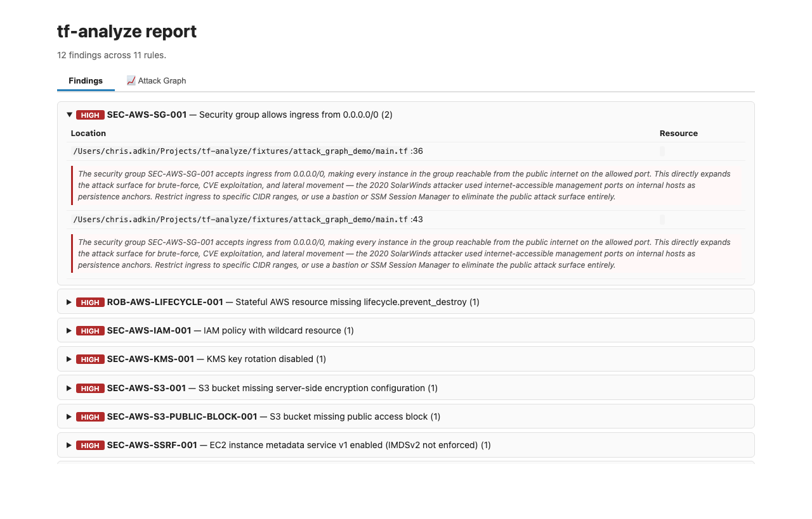

# `detect.py` CLI reference

**Auto-generated** by `scripts/gen-cli-docs.py` from `scripts/detect.py`'s argparse. Do not edit by hand — re-run the generator after changing flags.

## Scan target

### `--target TARGET`

Directory to scan (required for scans)

### `--catalog CATALOG`

**Default:** `<skill>/catalog`

Catalog directory

## Output

### `--format FORMAT`

**Choices:** `text`, `json`, `sarif`, `html`

**Default:** `text`

### `--reports-dir REPORTS_DIR`

Reports directory (default: <skill>/reports). Used for auto-discovery in --compare and --mode verify-fixed.

## Mode

### `--mode MODE`

**Choices:** `static`, `diff`, `verify-fixed`

**Default:** `static`

Execution mode. verify-fixed parses a prior report and re-probes.

### `--prior-report PRIOR_REPORT`

Markdown report to verify (for --mode verify-fixed). If omitted, picks the most recent tf-analysis-*.md under reports/.

### `--diff-base DIFF_BASE`

Git ref to diff against (e.g., main). Only scan changed .tf files.

### `--plan-json PATH`

Path to `terraform show -json plan.tfplan` output. When supplied, the catalogue's resource_arg / resource_missing_arg / resource_present / hcl_attr / data_source_present rules are re-evaluated against resolved values from the plan. Static findings still run; plan findings are tagged with mode='plan' so the report can disambiguate. Required for catching variable-resolved violations (e.g. tfvars setting an IAM role to a forbidden value).

## Filtering

### `--only-fixture ONLY_FIXTURE`

Restrict catalogue to entries listing this fixture name

### `--include-stubs`

Include catalogue entries with status: stub

### `--strict-catalog`

Abort with exit code 2 on any catalogue schema error. Default behaviour is loud-warn-and-skip: print ERROR lines to stderr and continue with the entries that did parse.

### `--focus FOCUS`

Restrict --list-rules / scans to entries in this section (security, robustness, dry, style, simplicity, ops, cicd, module, stack, verification).

## Suppression

### `--no-suppress`

Disable all suppression (show every finding). Default: suppressions from .tf-analyze-ignore.yaml + inline `# tf-analyze:ignore <ID>` comments are applied.

## Comparison & gating

### `--compare COMPARE`

Path to a prior JSON report to compare against (outputs delta)

### `--auto-compare`

Auto-discover most recent prior JSON report and compute delta.

### `--fail-on FAIL_ON`

**Choices:** `CRITICAL`, `HIGH`, `MEDIUM`, `LOW`, `INFO`

Exit with code 1 if any finding at this urgency or above exists

## Auto-stub

### `--auto-stub AUTO_STUB`

Directory to write auto-generated catalogue stubs. Combined with --propose-stub IDs or with findings whose IDs are novel (not in catalog).

### `--propose-stub PROPOSE_STUB`

Comma-separated list of exploratory IDs to scaffold as stubs. Used by the judgement pass to promote novel findings. Requires --auto-stub <dir>.

## Optional fast-path

### `--use-hcl2`

Enable optional python-hcl2 fast-path for heredoc-aware attribute extraction. Requires `pip install python-hcl2` — if the dependency is missing this flag is a no-op and the regex path is used. Off by default to honor the stdlib-only promise; can also be enabled via TF_ANALYZE_USE_HCL2=1.

## Meta-commands

### `--list-rules`

Print every catalogue ID with title and urgency, grouped by domain. Honors --focus, --include-stubs. No scan is run.

### `--explain RULE-ID`

Print the full catalogue entry for the given rule ID and exit. No scan is run.

### `--new-rule RULE-ID`

Scaffold a new catalogue entry and fixture skeleton for the given ID (must match DOMAIN-SUBDOMAIN-NNN format). Writes catalog/<ID>.yaml and fixtures/<slug>/main.tf with TODO markers, then exits.

## Other

### `-h/--help`

show this help message and exit

### `--attack-graph`

Build a directed attack-path graph from internet-reachable resources to crown jewels (RDS, KMS keys, Secrets Manager, S3/GCS buckets). With --format html adds an interactive Attack Graph tab (force-directed SVG, drag, click-to-inspect, critical path highlighted in red). With --format text (default) appends a Mermaid flowchart block after findings. Also enables adversarial scenario narratives for HIGH/CRITICAL findings.

**Example — Attack Graph tab (46-node AWS corpus, terragoat):**

Node colours: Internet (black) · Compute (blue) · IAM (purple) · Storage (green) · Secret (red) · Key (orange) · Network (grey). Critical-path nodes and edges are highlighted in red; crown jewels have a gold border. Click any node to open a sidebar showing the resource type, file, line number, and all finding IDs that touch it. Drag nodes to rearrange.

**Example — Findings tab with adversarial narrative:**

HIGH and CRITICAL findings display a bordered italic paragraph that names a confirmed real-world breach using the same attack vector (Capital One 2019, SolarWinds 2020, Tesla 2020, Samsung 2022, Twitch 2021).

### `--output`

Write report output to PATH instead of stdout. The file is created or overwritten. stderr (progress, counts, errors) is unaffected.

