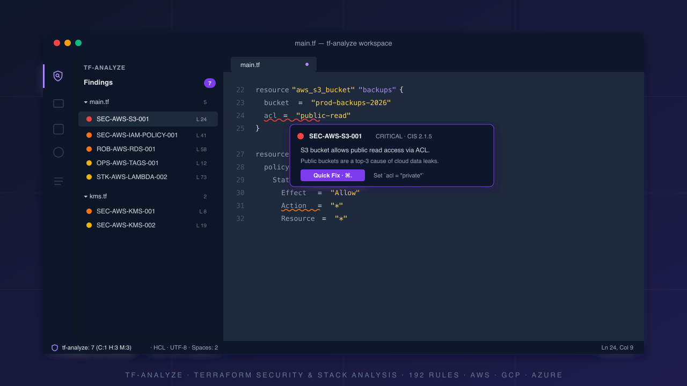

<p align="center">
  
</p>

# tf-analyze for VS Code

> **Terraform security & stack analysis — directly in your editor.**
> Inline findings, one-click Quick Fixes, and an interactive attack-graph view.

[](https://opensource.org/licenses/Apache-2.0)
[](https://code.visualstudio.com/)
[](https://www.terraform.io/)

---

## ✨ What it does

Brings the **`tf-analyze`** detection engine (192 catalogue rules across AWS, GCP, and Azure) into VS Code, so you see security and stack issues the moment you save a `.tf` file — no CLI runs, no context switching.

| | |
|---|---|
| 🔴 **Inline diagnostics** | Findings appear as red/yellow squiggles on the exact line that triggered the rule. Hover for the full explanation, severity, and CIS mapping. |
| ⚡ **Quick Fix actions** | When a rule has an auto-fix, hit `⌘.` / `Ctrl+.` to apply it without leaving the editor. |
| 🌳 **Findings tree** | A dedicated Activity Bar panel groups every finding by file → severity, with one click to jump to the source. |
| 🕸️ **Attack-graph view** | Visualise IAM, network, and KMS reachability between resources in an interactive webview — spot lateral-movement paths at a glance. |
| 💾 **Run-on-save** | Re-scans automatically every time you save. Toggle off if you'd rather drive it manually. |

---

## 🚀 Quickstart

### 1. Install the extension

From the `.vsix` file:

```bash
code --install-extension tf-analyze-0.1.4.vsix
```

Or search **`tf-analyze`** in the VS Code Marketplace.

### 2. Make sure `detect.py` is reachable

The extension is a **frontend** — it shells out to the [`tf-analyze`](https://github.com/ChrisAdkin8/tf-analyze) detection engine. You need either:

- The `tf-analyze` repo cloned somewhere on your machine (the extension auto-discovers `scripts/detect.py` in the open workspace), **or**
- Set `tf-analyze.scriptPath` to an absolute path to `detect.py`, **or**
- Have `detect.py` on `PATH`.

> 🐍 **Python 3.10+** is required. `python-hcl2` is optional but recommended for heredoc-aware parsing.

### 3. Open a Terraform file

Open any `.tf` file. You'll see:

- 🛡️ A **shield icon** on the left Activity Bar — click it to open the **Findings** tree.
- 🔴 Squiggles on offending lines.
- 📊 The status bar shows the scan summary, e.g. `🛡 tf-analyze: 6 (C:1 H:4 M:1)`. Click it to re-run the scan.

---

## 🎛️ Commands

All commands are available via the Command Palette (`⌘⇧P` / `Ctrl+Shift+P`):

| Command | What it does |
|---|---|
| `tf-analyze: Run Scan` | Force a fresh scan of the workspace. |
| `tf-analyze: Clear Findings` | Wipe diagnostics and the Findings tree. |
| `tf-analyze: Show Attack Graph` | Open the interactive resource-graph webview. |
| `tf-analyze: Open Finding` | Jump to the file/line of a Findings-tree entry. |

The 🛡️ scan and 🕸️ graph commands also appear as title-bar buttons on the Findings view.

---

## ⚙️ Settings

Configure under **Settings → Extensions → tf-analyze**, or in `settings.json`:

| Setting | Type | Default | Purpose |
|---|---|---|---|
| `tf-analyze.scriptPath` | `string` | `""` | Absolute path to `detect.py`. Leave empty for auto-detect. |
| `tf-analyze.failOn` | `enum` | `HIGH` | Minimum urgency to surface as an editor **error** (vs. warning/info). One of `LOW`, `MEDIUM`, `HIGH`, `CRITICAL`. |
| `tf-analyze.runOnSave` | `boolean` | `true` | Re-scan automatically when a `.tf` file is saved. |
| `tf-analyze.section` | `enum` | `""` | Restrict to one catalogue section: `security`, `robustness`, `ops`, `module`, `stack`, `style`. Empty = all. |
| `tf-analyze.extraArgs` | `string[]` | `[]` | Extra flags forwarded to `detect.py` (e.g. `["--compliance", "--compliance-framework", "pci_dss"]`). |

### Example: scope to security findings only, fail at `MEDIUM`

```jsonc
{
  "tf-analyze.section": "security",
  "tf-analyze.failOn": "MEDIUM",
  "tf-analyze.runOnSave": true
}
```

---

## 📋 Requirements

- **VS Code** `1.85.0` or later
- **Python** `3.10+` on `PATH`
- **`tf-analyze`** detection engine — see [the project repo](https://github.com/ChrisAdkin8/tf-analyze) for install instructions

---

## 🐛 Troubleshooting

<details>
<summary><b>The extension activates but I see no findings.</b></summary>

- Check the **Output** panel → **tf-analyze** channel. It logs the resolved `detect.py` path and the exact CLI invocation.
- If you see `detect.py not found`, set `tf-analyze.scriptPath` to an absolute path.
- Confirm the file you're editing is actually picked up by `detect.py` standalone:

  ```bash
  python3 /path/to/detect.py --root /path/to/your/terraform
  ```
</details>

<details>
<summary><b>I don't see the shield icon on the Activity Bar.</b></summary>

The extension activates on `onLanguage:terraform` or when the Findings view is opened. If you've just installed and have no `.tf` file open, click the shield icon on the left rail — opening it triggers activation.
</details>

<details>
<summary><b>Quick Fix isn't offered for a finding.</b></summary>

Not every rule has an auto-fix. Rules with `fix_hcl` support get Quick Fix; others link to the catalogue entry with a manual remediation note. The full list of fix-capable rules is in [`SKILL.md`](https://github.com/ChrisAdkin8/tf-analyze/blob/main/SKILL.md).
</details>

<details>
<summary><b>The attack-graph view is empty.</b></summary>

Graph edges are only computed for resources where intent (IAM, networking, KMS) can be resolved statically. Workspaces that lean heavily on `for_each` or computed module outputs may resolve few or no edges from source alone. Run `detect.py` from the CLI with `--verbose` to see what the engine resolved, and consult the [project docs](https://github.com/ChrisAdkin8/tf-analyze/blob/main/docs/cli.md) for advanced modes.
</details>

---

## 🔗 Links

- 📖 **Source**: [github.com/ChrisAdkin8/tf-analyze](https://github.com/ChrisAdkin8/tf-analyze)
- 🐞 **Issues**: [GitHub Issues](https://github.com/ChrisAdkin8/tf-analyze/issues)
- 📜 **License**: Apache 2.0 — see [`LICENSE`](./LICENSE)

---

<sub>Built with the `tf-analyze` Claude Code skill. 192 rules · AWS · GCP · Azure · zero pip dependencies.</sub>
